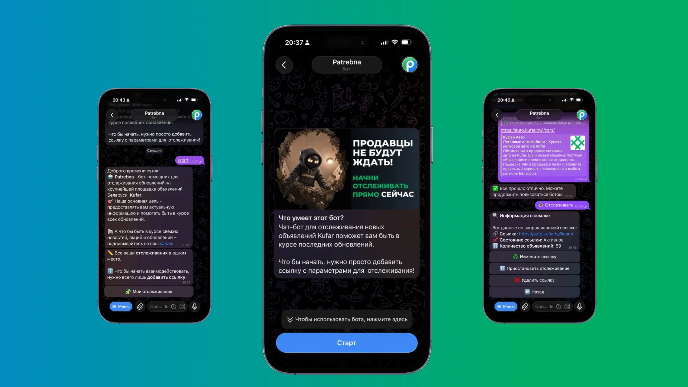
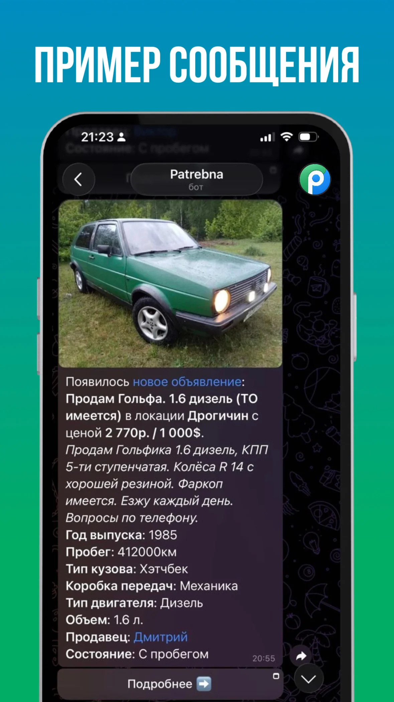

<p align="center">
  
</p>

<h1 align="center">PATREBNA</h1>

<p align="center">
  <a href="https://patrebna.by">
    🌐 Официальный сайт
  </a>
  &nbsp;&nbsp;•&nbsp;&nbsp;
  <a href="https://t.me/patrebnaBot?start=source_github">
    🤖 Patrebna Bot
  </a>
  &nbsp;&nbsp;•&nbsp;&nbsp;
  <a href="https://t.me/patrebna_news">
    📢 Новости проекта
  </a>
</p>

<p align="center">
  Telegram-бот, который следит за новыми объявлениями на Kufar и присылает их прямо в личные сообщения.
</p>

<p align="center">
  <strong>Быстрее находи нужные товары, квартиры, авто и выгодные предложения.</strong>
</p>

<p align="center">
  
</p>

## Что такое PATREBNA?

**PATREBNA** — это бот-парсер для Telegram, который автоматически отслеживает новые объявления на площадке **Kufar**.

Ты настраиваешь ссылку с нужной категорией, городом и фильтрами, а бот сам проверяет появление новых объявлений и присылает их тебе в личную переписку.

Больше не нужно вручную обновлять страницу и бояться пропустить хороший вариант.

---

## Для чего это удобно?

- Искать товары по выгодной цене
- Отслеживать квартиры и недвижимость
- Быстро реагировать на новые авто
- Следить за редкими позициями
- Получать уведомления без постоянного мониторинга Kufar

---

## Как это работает?

1. Открой Kufar
2. Выбери город, категорию и нужные фильтры
3. Скопируй ссылку вида:

```text
https://kufar.by/l/город/товар/
```

4. Запусти бота командой:

```text
/start
```

5. Добавь ссылку для отслеживания

Готово — бот начнёт мониторинг и пришлёт сообщение, когда появится новое объявление.

---

## Что приходит в уведомлении?

Бот собирает основную информацию по объявлению:

- Главное фото
- Заголовок
- Описание
- Цена
- Прямая ссылка на объявление
- Параметры и характеристики 

> Набор данных может отличаться в зависимости от категории и выбранного тарифа.

<p align="center">
  
</p>

---

# Тарифы

<p>
  Выберите подходящий тариф и получайте уведомления о новых объявлениях быстрее остальных.
</p>

## Бесплатный — 0 BYN

> Отличный способ начать пользоваться ботом и оценить его возможности.

**Подойдет для легкого старта**

### Возможности

- ✅ Обновления раз в 60 минут
- ✅ Отслеживание 1 ссылки
- ❌ Приоритетная поддержка
- ❌ Отсутствие рекламы
- ❌ Описание к каждому объявлению
- ❌ Дополнительные параметры к объявлениям
- ❌ Просмотр недвижимости на карте
- ❌ Ранний доступ к новым функциям
- ❌ Эксклюзивные возможности

---

## Базовый — 5 BYN / месяц

> Базовый формат объявлений со средней частотой обновления.

**Для регулярного использования**

### Возможности

- ✅ Обновления раз в 15 минут
- ✅ Отслеживание 1 ссылки
- ✅ Приоритетная поддержка
- ❌ Отсутствие рекламы
- ❌ Описание к каждому объявлению
- ❌ Дополнительные параметры к объявлениям
- ❌ Просмотр недвижимости на карте
- ❌ Ранний доступ к новым функциям
- ❌ Эксклюзивные возможности

---

## Основной —  25 BYN / месяц

> Максимальная скорость, расширенные возможности и никакой рекламы.

**Максимальные возможности**

### Возможности

- ✅ Обновления раз в 5 минут
- ✅ Отслеживание до 3 ссылок
- ✅ Приоритетная поддержка
- ✅ Отсутствие рекламы
- ✅ Описание к каждому объявлению
- ✅ Дополнительные параметры к объявлениям
- ✅ Просмотр недвижимости на карте
- ✅ Ранний доступ к новым функциям
- ✅ Эксклюзивные возможности

---

# FAQ

## Это официальный бот Kufar?

Нет, это не официальный бот Kufar.

PATREBNA — open-source проект, разработанный независимым белорусским программистом в апреле 2023 года. Сервис развивается автономно и никак не связан с Kufar официально.

---

## Какие данные собирает бот?

Бот использует только информацию, которую вы самостоятельно предоставляете:

- ссылки на отслеживание
- параметры поиска
- данные объявлений

Также используются базовые данные Telegram:

- имя
- фамилия
- username (если указан)

---

## Можно ли добавить бота в группу?

Нет.

PATREBNA работает только в личных сообщениях Telegram.

Если вам нужен нестандартный сценарий использования — можно обратиться в поддержку.

---

## Как отключить подписку?

Подписка оформляется на выбранный срок и автоматически завершается после его истечения.

Дополнительно через поддержку можно решить нестандартные ситуации:

- перенос подписки между аккаунтами
- пауза подписки
- индивидуальный срок
- другие вопросы

---

## Насколько безопасна оплата?

Оплата проходит через белорусский эквайринг **bePaid**.

Все платежные данные защищены и обрабатываются в соответствии с современными стандартами безопасности.

---

## Возможен ли пробный период?

Да.

Для знакомства с ботом доступен бесплатный тариф, который отлично подойдет для тестирования возможностей сервиса.

Вы сможете попробовать основные функции и понять, подходит ли вам PATREBNA, а затем при необходимости перейти на расширенные тарифы.

---

## Есть ли бонусы и скидки?

Да.

Внутри бота доступны:

- игровые активности
- реферальная система
- бонусы за действия
- кэшбек с оплат
- награды за приглашение друзей
- бонусы за подписку на канал

Накопленные бонусы можно использовать для оплаты функций и подписки внутри бота.
